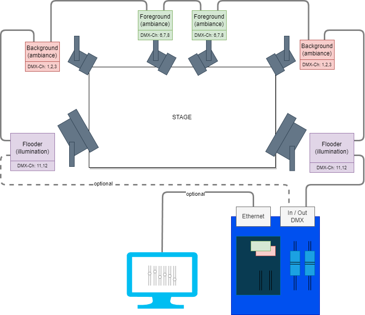
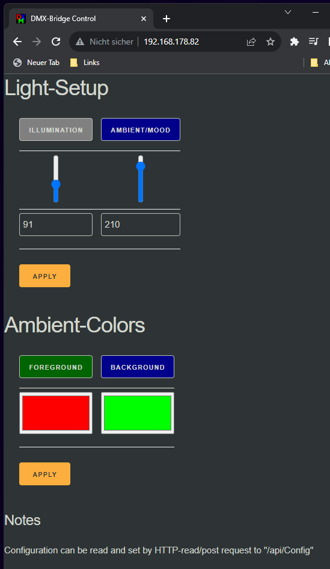
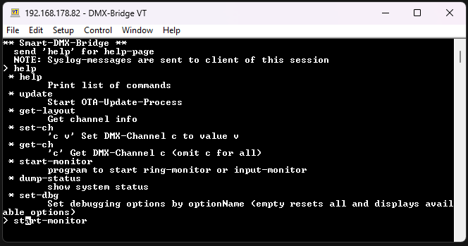
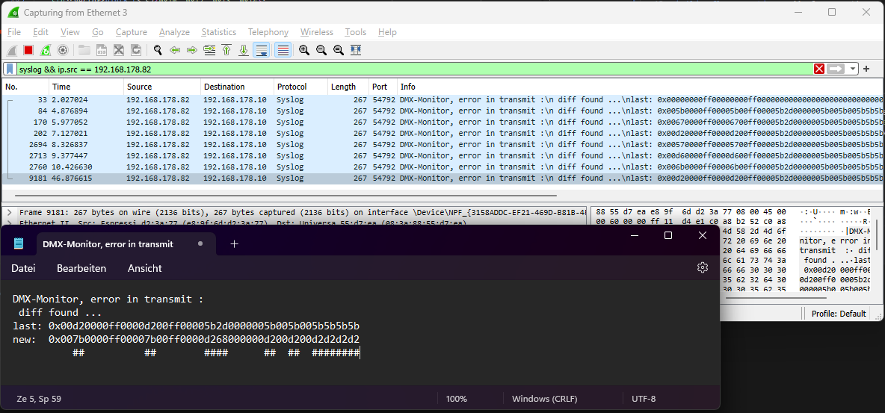

# Smart-DMX-Bridge

Small and simple bridge device with extra features.

The following pictures shows a demo configuration where this device controls a DMX-strip
incorporating two flooder, and four lights for foreground and background lighting.
Every mode shares common DMX channels (background 1-3, foreground 6-8 ...) to save DMX-channels

## Stand-alone-mode

The main purpose of this device is to control a relatively complex stage by only two sliders in stand alone mode
(like shown in the previous picture)
This enables novices or guest to simple turn on a pre-configured stage lighting without any training.

One slider controls the intensity of the illumination of the stage.
The other controls the intensity of the ambient-lighting, where foreground and
background color are both controlled together.

An integrated display allows to change the mood / ambient (set of foreground/background color)

## ArtNet-Bridge

If full control if all channels is needed individually, one can connect to this device by ethernet
using a lighting console tool like [Q Light Controller+](https://www.qlcplus.org/).
This mutes the internal sliders and gives full control to chosen lighting console.

## Web-Interface

The web interface allows the control of the stage by two virtual sliders like on the device.
It also provides two color pickers to update the foreground and background colors.

## Telnet / Syslog

An additional telnet-shell allows to trigger testing and sensing mode.

* The *ring-test-mode* applies the current configuration but reads sent data back and compares it.
  If a mismatch is found a syslog is issued to the destination that started the procedure
* The sensing mode reads the input and compares it to the last input.
  If a mismatch is found a syslog is issued to the destination that started the procedure

This interface is also able to start an update process wia HTTP-server.

The following pictures shows an example how diff data is transmitted via syslog

## Technical background

Following hardware is used

* **ESP32-POE-ISO** ESP32 based board with isolated power over Ethernet utility and RMII connected Phy
* **Nextion NX3224K024** Smart display that heavily simplifies GUI development
* **RS422** Driver board for DMX-Signals

Note: Currently i am planning to develop an actual box with an dedicated PCB. Schematics will be included in this project.

The Firmware is based on Espressif IOT-Dev-Framework. The project is generated with [PlatformIO](https://platformio.org/).
Sorry no Arduino here because of the RMII-connected phy (I wanted a reliable solution).

## Issues and open Tasks

* Usability of the system is quite bad ad the current state. You get quite few messages what is going on now.
  * The Display must provide clear info when the device is not in standalone mode
  * If an Firmware update is triggered there is no feedback what is currently going on and if the update is successful
  * To much logging is happening via internal serial interface. It should be more piped through telnet shell or web interface
* Simplified stream abstraction is rather inconvenient
* Security issues
  * OTA-Update should verify the request by certificate
  * Telnet shell is open
* Syslog is no real syslog ... it only uses the correct port
* Coredump-feature should be enabled
* Nextion Driver has still some unpleasant spots that need finalization
* Sensing interface seems not to work always properly
* There is too much logging output in different modules that slows the controller down
* Websockets missing to trigger updates on webpage if it is used concurrently by multiple users